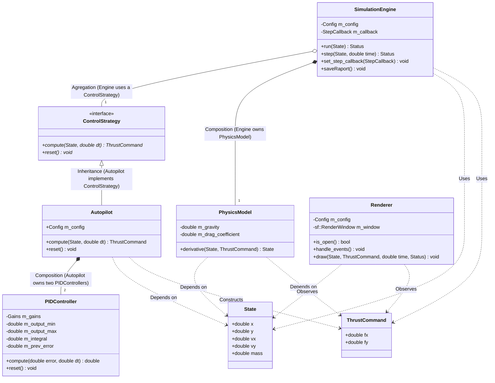
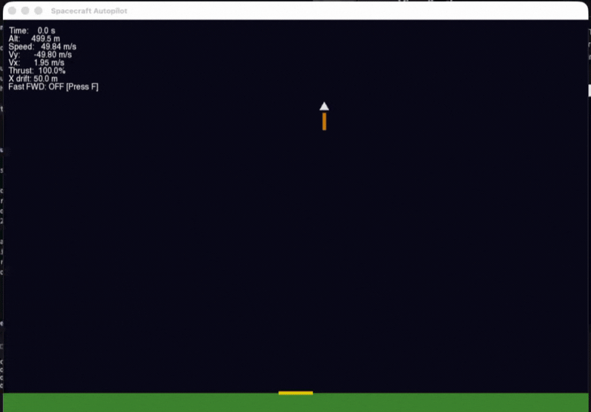

# Spacecraft Autopilot Simulation

A modular 2D spacecraft autopilot system written in modern C++20. The simulation models a spacecraft performing an autonomous vertical landing using a PID control strategy, with a physics engine, unit-tested core logic, and a real-time SFML visualization.

Built as a portfolio project demonstrating clean architecture, modern C++ practices, and practical control systems implementation.


---

## Features

- **Physics engine** — 2D Newtonian motion with gravity, thrust, and atmospheric drag
- **RK4 integrator** — Runge-Kutta 4th order numerical integration
- **PID autopilot** — dual-axis controller for vertical descent and horizontal stabilization
- **Data Logging** - CSV output of time, position, velocity, and control commands for post-simulation analysis
- **Extensible control interface** — `ControlStrategy` abstraction allows plugging in LQR, MPC, or any custom algorithm
- **Unit tested** — GoogleTest coverage for physics, PID controller, and autopilot logic
- **CI pipeline** — GitHub Actions builds and runs all tests on every push
- **SFML visualization** — real-time rendering of trajectory, velocity, and HUD *(in progress)*

---

## Architecture

```
src/
├── core/
│   ├── State.hpp                 # spacecraft state: position, velocity, mass
│   └── SimulationEngine.hpp/.cpp # main simulation loop, RK4 integrator, logging
├── physics/
│   └── PhysicsModel.hpp/cpp      # force accumulation, drag, gravity
├── control/
│   ├── ControlStrategy.hpp       # abstract interface for control algorithms
│   ├── PIDController.hpp/cpp     # clamped PID with anti-windup
│   └── Autopilot.hpp/cpp         # dual-axis autopilot using PIDController
├── rendering/
│   └── Renderer.hpp/cpp          # SFML-based visualization
└── main.cpp

tests/
├── test_physics_model.cpp
├── test_pid_controller.cpp
└── test_autopilot.cpp

output_data/                      # stores saved after simulations
├── raport_1.csv
└── ...
```

## UML
Relationships between main classes and interfaces in the simulation architecture



---

## Build Instructions

### Requirements

- C++20 compiler (AppleClang 17+, GCC 13+, or Clang 15+)
- CMake 3.20+
- SFML 2.6 *(optional, required for visualization)*

### macOS

```bash
brew install cmake sfml
```

### Ubuntu

```bash
sudo apt-get install cmake build-essential libsfml-dev
```

### Build & Run

```bash
git clone https://github.com/BartoliniBartlomiej/Spacecraft-Autopilot.git
cd Spacecraft-Autopilot

cmake -B build -DCMAKE_BUILD_TYPE=Release
cmake --build build --parallel

./build/spacecraft
```

### Run Tests

```bash
ctest --test-dir build --output-on-failure
```

---

## How It Works

The simulation runs a fixed-timestep loop:

```
1. Read current State (position, velocity, mass)
2. Autopilot computes ThrustCommand via PID controllers
3. PhysicsModel accumulates forces (thrust + gravity + drag)
4. RK4 integrator advances State by dt
5. Log output
6. Repeat until landed or fuel exhausted
```

The vertical PID targets a safe descent velocity (default: 0 m/s), while the horizontal PID keeps the spacecraft aligned over the landing zone.

---

## PID Tuning

Default gains in `config/simulation.json`:

| Axis | Kp | Ki | Kd |
|---|---|---|---|
| Vertical | 2.0 | 0.1 | 1.5 |
| Horizontal | 1.2 | 0.05 | 0.8 |

---

## Data Logging

First version of the simulation includes CSV logging of time, position, velocity, and control commands. This allows for post-simulation analysis and plotting of trajectories, velocity profiles, and control inputs using tools like python, matplotlib or Excel. 

However, the first version of data logging includes PID controllers parameters, that are constant during the simulation, for each step. This creates a problem with the size of the output file, which grows significantly. In the future, I plan to refactor the logging system to only log parameters when they change, or to log them separately in a configuration file.

| Time   | X      | Y      | Vx     | Vy      | Mass    | ThrustX    | ThrustY   | VerticalError | HorizontalError | VerticalOutput | HorizontalOutput | Kp_v⚠️| Ki_v⚠️| Kd_v⚠️| Kp_h⚠️| Ki_h⚠️| Kd_h⚠️|
|--------|--------|--------|--------|---------|---------|------------|-------------|----------------|-----------------|----------------|------------------|---------|--------|--------|--------|--------|--------|
| 0.0000 | 50.0000 | 500.0000 | 2.0000 | -50.0000 | 500.0000 | -2550.0000 | 15000.0000 | 48.5000 | -50.0000 | 15000.0000 | -2550.0000 | 1000.0000 | 0.5000 | 30.0000 | 1.0000 | 0.0000 | 0.5000 |
| 0.0100 | 50.0197 | 499.5010 | 1.9490 | -49.7981 | 500.0000 | -51.0070 | 15000.0000 | 48.2981 | -50.0197 | 15000.0000 | -51.0070 | 1000.0000 | 0.5000 | 30.0000 | 1.0000 | 0.0000 | 0.5000 |
|...|...|...|...|...|...|...|...|...|...|...|...|...|...|...|...|...|...|

In this version data file from 10 minutes of simulation with 100Hz logging frequency is about 4.5MB. Log without PID parameters (`Kp_v`, `Ki_v`, `Kd_v` and `Kp_h`, `Ki_h`, `Kd_h`) is aproximately 3 MB. This represents a 33.3% reduction in file size. 

Although the PID parameters are constant during the simulation, they can be useful for debugging and analysis, especially if we want to experiment with different gain values or use ML techniques to optimize them.

---

## Visualization

For visualization of the simulation, I use SFML library. The renderer displays the spacecraft as a simple triangle, with a trajectory trail and a HUD showing current velocity, altitude and other parameters. The visualization runs in real-time alongside the physics simulation, allowing for an intuitive understanding of how the control inputs affect the landing process.



---

## Project Status

| Phase | Status |
|---|---|
| Core simulation (physics, integrator) | ✅ Done |
| PID controller | ✅ Done |
| Autopilot + ControlStrategy interface | ✅ Done |
| Unit tests (12/12 passing) | ✅ Done |
| CI pipeline | ✅ Done |
| SFML visualization | ✅ Done |
| SimulationEngine (main loop) | 🔄 In progress |
| CSV data export | 🔄 In progress |
| JSON config loader | ⏳ Planned |


---

## Possible Extensions

- Additional control strategies (LQR, bang-bang, MPC) via `ControlStrategy` interface
- ImGui overlay for live PID tuning
- Trajectory optimisation (minimum fuel landing)
- Multi-stage rocket with stage separation
- Data export for external plotting and analysis (python, matplotlib, MATLAB)

---
