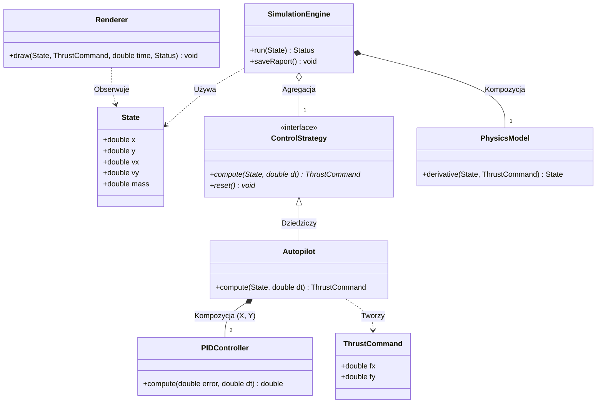

# Spacecraft Autopilot Simulation

A modular 2D spacecraft autopilot system written in modern C++20. The simulation models a spacecraft performing an autonomous vertical landing using a PID control strategy, with a physics engine, unit-tested core logic, and a real-time SFML visualization.

Built as a portfolio project demonstrating clean architecture, modern C++ practices, and practical control systems implementation.


---

## Features

- **Physics engine** — 2D Newtonian motion with gravity, thrust, and atmospheric drag
- **RK4 integrator** — Runge-Kutta 4th order numerical integration
- **PID autopilot** — dual-axis controller for vertical descent and horizontal stabilization
- **Extensible control interface** — `ControlStrategy` abstraction allows plugging in LQR, MPC, or any custom algorithm
- **Unit tested** — GoogleTest coverage for physics, PID controller, and autopilot logic
- **CI pipeline** — GitHub Actions builds and runs all tests on every push
- **SFML visualization** — real-time rendering of trajectory, velocity, and HUD *(in progress)*

---

## Architecture

```
src/
├── core/
│   └── State.hpp               # spacecraft state: position, velocity, mass
├── physics/
│   ├── PhysicsModel.hpp/cpp    # force accumulation, drag, gravity
├── control/
│   ├── ControlStrategy.hpp     # abstract interface for control algorithms
│   ├── PIDController.hpp/cpp   # clamped PID with anti-windup
│   └── Autopilot.hpp/cpp       # dual-axis autopilot using PIDController
└── main.cpp

tests/
├── test_physics_model.cpp
├── test_pid_controller.cpp
└── test_autopilot.cpp
```


## Architektura systemu

Poniższy diagram przedstawia relacje między najważniejszymi klasami w projekcie (wzorzec Strategii, kompozycja PID oraz główny silnik symulacji):


---

## Build Instructions

### Requirements

- C++20 compiler (AppleClang 17+, GCC 13+, or Clang 15+)
- CMake 3.20+
- SFML 2.6 *(optional, required for visualization)*

### macOS

```bash
brew install cmake sfml
```

### Ubuntu

```bash
sudo apt-get install cmake build-essential libsfml-dev
```

### Build & Run

```bash
git clone https://github.com/BartoliniBartlomiej/Spacecraft-Autopilot.git
cd Spacecraft-Autopilot

cmake -B build -DCMAKE_BUILD_TYPE=Release
cmake --build build --parallel

./build/spacecraft
```

### Run Tests

```bash
ctest --test-dir build --output-on-failure
```

---

## How It Works

The simulation runs a fixed-timestep loop:

```
1. Read current State (position, velocity, mass)
2. Autopilot computes ThrustCommand via PID controllers
3. PhysicsModel accumulates forces (thrust + gravity + drag)
4. RK4 integrator advances State by dt
5. Log output
6. Repeat until landed or fuel exhausted
```

The vertical PID targets a safe descent velocity (default: 0 m/s), while the horizontal PID keeps the spacecraft aligned over the landing zone.

---

## PID Tuning

Default gains in `config/simulation.json`:

| Axis | Kp | Ki | Kd |
|---|---|---|---|
| Vertical | 2.0 | 0.1 | 1.5 |
| Horizontal | 1.2 | 0.05 | 0.8 |

Adjust these values to experiment with different landing behaviours — higher `Kd` reduces overshoot, higher `Ki` corrects steady-state drift.

---

## Project Status

| Phase | Status |
|---|---|
| Core simulation (physics, integrator) | ✅ Done |
| PID controller | ✅ Done |
| Autopilot + ControlStrategy interface | ✅ Done |
| Unit tests (12/12 passing) | ✅ Done |
| CI pipeline | ✅ Done |
| SimulationEngine (main loop) | 🔄 In progress |
| SFML visualization | ⏳ Planned |
| JSON config loader | ⏳ Planned |
| CSV data export | ⏳ Planned |

---

## Possible Extensions

- Additional control strategies (LQR, bang-bang, MPC) via `ControlStrategy` interface
- ImGui overlay for live PID tuning
- Trajectory optimisation (minimum fuel landing)
- Multi-stage rocket with stage separation
- Data export for external plotting (matplotlib, MATLAB)

---
